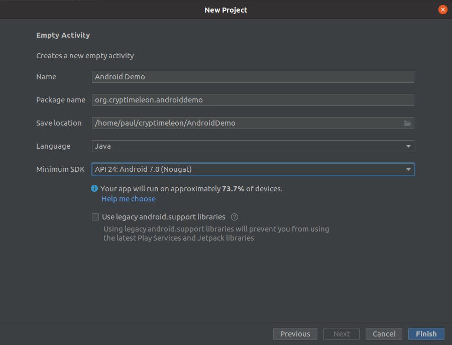

[](https://github.com/cryptimeleon/android-demo/actions/workflows/workflow.yaml)

# Cryptimeleon on Android

This repository is an example of how to use the cryptimeleon libraries on android.
We therefore implement the Pointcheval-Sanders signature scheme from the [pairing tutorial](https://cryptimeleon.github.io/getting-started/pairing-tutorial.html).

## How to use cryptimeleon on android

 1. Create a new android project in Android Studio. 
 2. Add cryptimeleon dependencies to `app/build.gradle`:
      ```
      implementation 'org.cryptimeleon:math:2.0.0'
      implementation 'org.cryptimeleon:craco:2.0.0'
      ```
    You can find details on the maven pages: [math](https://search.maven.org/artifact/org.cryptimeleon/math/2.0.0/jar), [craco](https://search.maven.org/artifact/org.cryptimeleon/craco/2.0.0/jar)

## Faster pairings with mcl

We use the C++ library [herumi/mcl](https://github.com/herumi/mcl) as a fast implementation of the BarretoNaehrig group.
This provides a massive speedup compared to the Java implementation.

### Precompiled library

We provide a precompiled version of `mcljava` for different architectures at `app/src/main/jniLibs`.
To use them, you need to load the library with the `System.loadLibrary("mcljava")` command.
By adding the dependency `implementation 'org.cryptimeleon:mclwrap:1.0.0'` to the inner build.gradle, you get access to the `MclBilinearGroup`.

### Compile MCL for android

This needs to be compiled using NDK and added to the project as a jniLib.

 1. Install [NDK](https://developer.android.com/studio/projects/install-ndk)
 2. Checkout [MCL](https://github.com/herumi/mcl) with the *correct version* (currently v1.28, which is the first release with native android support)
 3. Build mcl (might not be necessary) by following the instructions
 4. Build mcl for android: Go to `mcl/ffi/java/android/jni` and call `ndk-build` (either add ndk-build to your path, or use an absolute path, e.g. `$<path-to-mcl>/ffi/java/android/jni$ ~/Android/Sdk/ndk/22.1.7171670/ndk-build`)
 5. Copy the directories in `mcl/ffi/java/android/libs` (which contain the `libmcljava.so` file) to `app/src/main/jniLibs`
 6. Load mcl in the app prior usage with `System.loadLibrary("mcljava")`, e.g. in `MainActivity.onCreate`.
 7. Add the dependency `implementation 'org.cryptimeleon:mclwrap:1.0.0'` to the app's build.gradle